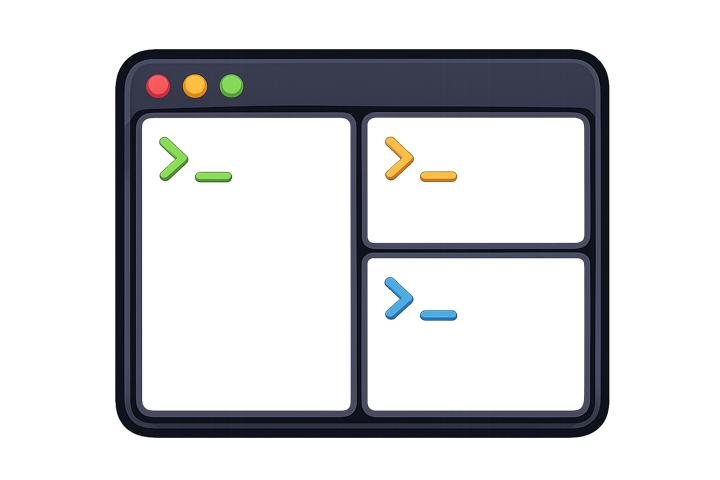

<div align="center">

# tpane

<p></p>

**Lua-powered tmux config with plugins, themes, widgets and more 🌟**

[](https://github.com/phcurado/tpane/releases)
[](https://github.com/phcurado/tpane/releases)
[](https://crates.io/crates/tpane)
[](LICENSE)

**[Docs](https://phcurado.github.io/tpane/) &nbsp;&nbsp;•&nbsp;&nbsp;**
**[Quick start](https://phcurado.github.io/tpane/quick-start) &nbsp;&nbsp;•&nbsp;&nbsp;**
**[Install](https://phcurado.github.io/tpane/install) &nbsp;&nbsp;•&nbsp;&nbsp;**
**[Changelog](CHANGELOG.md)**

</div>

## Introduction

tpane lets you write tmux configuration in Lua. It comes with plugins, themes,
status bar widgets, and helpers for key bindings, panes, windows, and common tmux
settings.

## Demo

https://github.com/user-attachments/assets/2e92141d-1e6e-407e-903e-29453cbf95ff

## Quick start

Install the latest release:

```sh
curl -fsSL https://raw.githubusercontent.com/phcurado/tpane/main/install.sh | sh
```

Add tpane at the end of `~/.config/tmux/tmux.conf`:

```tmux
run-shell -b 'tpane'
```

Create `~/.config/tmux/tpane/init.lua`:

```lua
tpane.use("sensible")
tpane.use("themes")

tpane.theme("Catppuccin Mocha")

tpane.opt.mouse = true
tpane.opt.mode_keys = "vi"

tpane.bind("h", tpane.pane.select("left"))
tpane.bind("j", tpane.pane.select("down"))
tpane.bind("k", tpane.pane.select("up"))
tpane.bind("l", tpane.pane.select("right"))

local battery = tpane.widgets.battery({ every = "30s" })

tpane.statusline {
  position = "top",
  left = { tpane.widgets.session, tpane.widgets.tabs },
  right = { battery, tpane.widgets.clock, tpane.widgets.date, tpane.widgets.prefix },
}
```

The code above replaces most of what you would normally put in `tmux.conf`: keybinds, plugins, options and the status bar.

## Install

Install script:

```sh
curl -fsSL https://raw.githubusercontent.com/phcurado/tpane/main/install.sh | sh
```

From crates.io:

```sh
cargo install tpane
```

With mise:

```sh
mise use -g github:phcurado/tpane@latest
mise upgrade github:phcurado/tpane
```

From source:

```sh
cargo install --path . --locked --force
```

## Minimal tmux.conf

Keep `tmux.conf` minimal, then start `tpane` with `run-shell` so it can apply the rest of your config from Lua.

```tmux
set -g default-terminal "xterm-256color"
set -as terminal-features ",xterm-256color:RGB"

set -g base-index 1
set -g pane-base-index 1

unbind C-b
set -g prefix C-a
bind C-a send-prefix

# Keep this last.
run-shell -b 'tpane'
```

## Lua config

tpane loads top-level Lua files from:

```text
~/.config/tmux/tpane
```

Set `TPANE_CONFIG_DIR` to use another directory.

Files in subdirectories are not loaded automatically; use Lua `require` for
shared modules:

```lua
local colors = require("theme.colors") -- ~/.config/tmux/tpane/theme/colors.lua
```

### Options

Use `tpane.opt` for normal tmux options:

```lua
tpane.opt.mouse = true              -- set -g mouse on
tpane.opt.history_limit = 5000      -- set -g history-limit 5000
tpane.opt.mode_keys = "vi"          -- set -g mode-keys vi
tpane.opt.renumber_windows = true   -- set -g renumber-windows on
tpane.opt.escape_time = 0           -- set -g escape-time 0
```

Use `tpane.append` when you would use `set -ga` in tmux:

```lua
tpane.append("update_environment", "TERM")
tpane.append("update_environment", "TERM_PROGRAM")
```

### Key bindings

`tpane.bind` connects a key to an action.

```lua
tpane.bind("h", tpane.pane.select("left"))
tpane.bind("j", tpane.pane.select("down"))
tpane.bind("k", tpane.pane.select("up"))
tpane.bind("l", tpane.pane.select("right"))

tpane.bind("%", tpane.pane.split("right", { cwd = "pane" }))
tpane.bind('"', tpane.pane.split("down", { cwd = "pane" }))
```

Bindings use the tmux prefix by default. Pass `prefix = false` for root bindings:

```lua
tpane.bind("M-Left", tpane.pane.resize("left", 10), { prefix = false })
```

A binding can also run a function in Lua. The callback receives the pane that pressed the key:

```lua
tpane.bind("L", function(pane)
  tpane.toggle(pane, "logs")
end)
```

If tpane does not have a helper for something, use raw tmux commands:

```lua
tpane.bind("R", "source-file ~/.config/tmux/tmux.conf ; display 'reloaded'")
```

## Status bar and tabs

The status bar is built from widgets. A widget is a Lua function that returns
text, styled text, or nothing.

```lua
local cwd = tpane.widget(function(ctx)
  return ctx.pane and ctx.pane.cwd_basename or ""
end)

tpane.statusline {
  position = "top",
  left = { tpane.widgets.session, tpane.widgets.tabs },
  right = { cwd, tpane.widgets.clock },
}
```

Built-in widgets:

| Widget                        | Description                                                 |
| ----------------------------- | ----------------------------------------------------------- |
| `tpane.widgets.session`       | Current tmux session.                                       |
| `tpane.widgets.host`          | Hostname from tmux.                                         |
| `tpane.widgets.clock`         | Current time, like `14:30`.                                 |
| `tpane.widgets.date`          | Current date, like `Jun 25`.                                |
| `tpane.widgets.prefix`        | Shows when tmux prefix is active.                           |
| `tpane.widgets.tabs`          | tmux window tabs.                                           |
| `tpane.widgets.cpu(opts)`     | CPU usage. Works on Linux and macOS.                        |
| `tpane.widgets.memory(opts)`  | Used memory. Works on Linux and macOS.                      |
| `tpane.widgets.battery(opts)` | Battery status with icons. Works on Linux and macOS.        |
| `tpane.widgets.player(opts)`  | Current playing track. Uses `playerctl`, Music, or Spotify. |

Some widgets start background jobs, so you call them once and reuse the returned widget:

```lua
local cpu = tpane.widgets.cpu({ every = "2s" })
local memory = tpane.widgets.memory({ every = "5s" })
local battery = tpane.widgets.battery({ every = "30s" })

tpane.statusline {
  right = { cpu, memory, battery, tpane.widgets.clock },
}
```

Use rows for a multiline status bar:

```lua
tpane.statusline {
  position = "top",
  rows = {
    { left = { tpane.widgets.session }, right = { tpane.widgets.clock } },
    { left = { tpane.widgets.tabs }, right = { tpane.widgets.prefix } },
  },
}
```

Customize tmux window tabs with `tpane.tabline`:

```lua
tpane.tabline {
  label = "cwd",
  inactive = { fg = "#777777" },
  current = { fg = "#8caaee", bold = true },
}
```

## Plugins

tpane comes with a plugin manager. There are built-in plugins that can be easily referenced by their name:

```lua
tpane.use("sensible")       -- common tmux defaults
tpane.use("vim-navigator")  -- C-h/j/k/l navigation with Vim awareness
tpane.use("yank")           -- copy/yank bindings
tpane.use("themes")         -- bundled color schemes
```

If you reference the `themes` plugin, you can use any [iTerm2 color schemes](https://github.com/mbadolato/iterm2-color-schemes)

```lua
tpane.use("themes")
tpane.theme("Gruvbox Dark", { transparent = true })
```

To see the available themes, run the following command in your terminal:

```sh
tpane themes
```

You can also create and use external plugins by referencing their source:

```lua
tpane.use("theme", {
  repo = "https://github.com/example/tpane-theme.git",
  branch = "main",
})
```

And use the plugin CLI to manage it:

```sh
tpane plugin status
tpane plugin sync
tpane plugin update
tpane plugin clean
tpane plugin list
tpane plugin remove NAME
```

See the [plugin docs](https://phcurado.github.io/tpane/plugins) for details.

## CLI

```sh
tpane             # start or reload the daemon from inside tmux
tpane --version   # print version
tpane status      # show load/runtime errors
tpane reload      # reload Lua config
tpane refresh     # reload and rescan panes
tpane doctor      # inspect hidden panes/sessions
tpane themes      # list bundled themes
tpane update      # update tpane
```

Documentation: https://phcurado.github.io/tpane/
